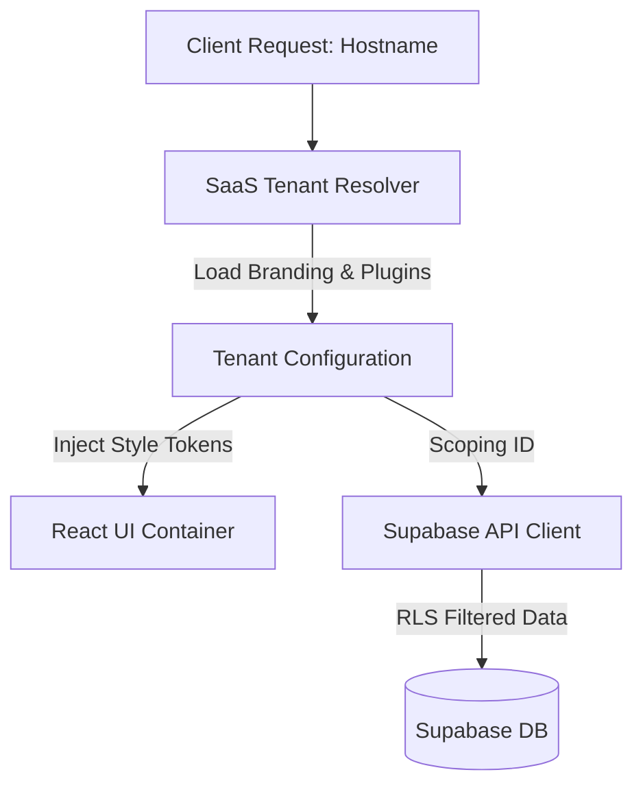

# VectoMatrix: Architecture and Feature Catalog

This document consolidates and outlines the multi-tenant SaaS architecture, B2B vendor inventory, B2C traveler interfaces, mobile application layers, and workflow systems of the VectoMatrix Travel & Tours ecosystem.

---

## 1. Multi-Tenant SaaS Architecture

VectoMatrix runs as a single-instance, multi-tenant Software-as-a-Service (SaaS) application designed for scale.

### Tenant Isolation Model
* **Tenant Scoping**: Each travel agency or brand acts as a **Tenant**. They are resolved dynamically via the request hostname (subdomain/custom domain) or fallback sub-path configuration.
* **Database Isolation**: In live mode, all rows in the `packages` and `leads` tables are scoped using a UUID-based `agency_id` or `tenant_id` linked back to the `agencies` table.
* **Primary Tenant Example (TRUEMEMORIES)**:
  - **Tenant ID**: `tenant-truememories`
  - **Domains**: `localhost` (during local development), `truememories.vectomatrix.com` (production)
  - **Branding**: Dynamic orange theme (`#ea580c`) loaded dynamically via UI configuration.
  - **Active Plugins**: Promotional Billboards, Package Comparison, Multi-Image Gallery, Stripe Checkout.



### Modular Plugin & Addon System
Features are decoupled from the core framework and loaded conditionally based on the tenant's active subscriptions or metadata flags:
1. **`addon-stripe-checkout`**: Enables direct online payment processing. When disabled, the checkout reverts to standard lead generation inquiry forms.
2. **`addon-promotional-billboards`**: Renders a rotating hero billboard banner section. When disabled, it falls back to a static search banner.
3. **`addon-package-comparison`**: Adds a comparison panel allowing side-by-side matches of up to three packages.
4. **`addon-image-gallery-upload`**: Enables a multi-image slider and uploader in B2B inventory interfaces instead of a single image URL text field.

---

## 2. Core Ecosystem Features & Workflows

### 2.1 B2B Travel Agency Operations (Vendor Portal)
* **Inventory Management**: Agencies create, read, update, archive, and delete travel packages (containing destinations, base pricing in MUR, hotel details, flight info, and baggage policies).
* **Lead Pipeline (CRM)**: Incoming inquiries and paid bookings populate the CRM. Agencies track leads through a unified pipeline pipeline (statuses: `PENDING`, `CLAIMED`, `CONVERTED`, `LOST`).
* **Automated Emailing**: Converting a lead triggers Next.js SMTP services, which automatically compiles and emails the customer their travel itinerary, vouchers, and transaction receipt.

### 2.2 B2C Traveler Operations (Web & Mobile Portals)
* **Discovery Feed**: Live feed displaying active packages. Includes fuzzy search, price filters, destination categorizations, and month filters.
* **Secure Checkout**: Users purchase packages using Stripe or submit inquiries. Stripe purchases automatically register as paid leads in the CRM database.
* **Customer Dashboard**: A dashboard where customers input their email to retrieve active bookings, itineraries, payment records, and inquiry statuses.

### 2.3 Agency Verification Workflow
To maintain platform integrity and prevent fraud, new vendors must pass through an onboarding validation workflow:
1. **Onboarding Submission**: When registering, agencies must supply their Business Registration Number (BRN) and contact details.
2. **Verification State**: By default, new agencies are created with a state of `is_verified = false`.
3. **Super Admin Review**: A platform Super Admin reviews the credentials in the admin interface. They run background checks against official business databases.
4. **Approval Toggle**: Upon verification, the Super Admin updates the agency record to `is_verified = true`.
5. **RLS Enforcement**: The Supabase database implements RLS check constraints. Only packages and leads belonging to verified agencies are queryable by the public discovery feed. Unverified agencies are restricted from publishing inventory or initiating Stripe checkout routes.

### 2.4 Lead Generation to Booking Fulfillment Transition
The platform bridges simple inquiry collection and confirmed booking fulfillment via a state-machine progression:
1. **Lead Creation**: A visitor either submits an inquiry (unpaid lead) or completes checkout (paid booking lead).
2. **Fulfillment State Machine**:
   - `PENDING`: The lead enters the B2B dashboard. Staff receive a visual notification.
   - `CLAIMED` / `CONTACTED`: An agency agent claims the lead and contacts the traveler to custom-tailor flights, transfer arrangements, or lodging upgrades.
   - `CONVERTED`: Once negotiations/itinerary selections are locked, the agent marks the lead as `CONVERTED` in the dashboard.
   - `LOST`: Marked if the client cancels or chooses another provider.
3. **Automated Ticketing**: Toggling a lead to `CONVERTED` fires a system event that generates a PDF voucher and triggers the SMTP server to send a comprehensive booking fulfillment email.

### 2.5 Customer Support System Integration
Support is baked into both frontends to reduce traveler friction:
* **Conversational Lead Hooks**: Inquiry forms double as support tickets in the agency dashboard. Customers can message support pre-booking.
* **Auto-Routing**: Inquiries are automatically tagged with the target package's `agency_id` to route messages directly to the responsible vendor.
* **Customer Portal Help**: The Customer Dashboard contains direct links to dial the assigned agency support number, initiate a WhatsApp Chat pre-seeded with booking details, or mail the agency's registered customer support email.

---

## 3. Mobile Architecture & Navigation

The mobile application is built using **React Native** and **Expo SDK** to target iOS and Android devices, sharing logical components with the web portals.

### Mobile Navigation Structure
The application utilizes `@react-navigation/native` with a structured navigation tree. The main flows are organized into a nested navigator structure:

```
AppContainer
 ├── AuthStack (Shown to guests)
 │    ├── LoginScreen
 │    └── RegisterScreen
 └── AppTabNavigator (Main Tab Hub)
      ├── DiscoverStack (Search & Detail exploration)
      │    ├── DiscoverFeedScreen
      │    └── PackageDetailScreen
      ├── BookingStack (Checkout & Payment Flow)
      │    ├── CheckoutScreen
      │    ├── PaymentSuccessScreen
      │    └── PaymentFailedScreen
      ├── CustomerDashboardStack (Wallet & Offline Queue)
      │    └── DashboardScreen
      └── SupportScreen (Direct messaging / chatbot)
```

#### Navigator Screen Details:
1. **`DiscoverFeedScreen`**: Grid layout showing active travel options, a destination carousel, and a slide-out search filter sheet.
2. **`PackageDetailScreen`**: Detailed view containing package itineraries, lodging meal plans, interactive maps, and options to either **Book Now** (Stripe) or **Inquire** (Lead form).
3. **`CheckoutScreen`**: Native input forms for passenger profiles, travel insurance selections, and add-on toggles (e.g., e-SIM, private transfers).
4. **`DashboardScreen`**: A traveler's local wallet. Displays past itineraries and the active offline queue.
5. **`SupportScreen`**: Standard support ticketing interface and links to launch native dialers or external WhatsApp chats.

### Offline Sync Engine
The mobile application uses the custom `@vectormatrix/mock-engine` package over React Native's `AsyncStorage` adapter to operate in poor connectivity areas.
* **Pending Queue**: When offline, database writes (bookings, feedback, lead updates) are captured locally and flagged with `_isPendingSync = true` in a dedicated local collection (`vmx_offline_queue`).
* **Detection & Hook**: A `useOfflineSync` hook monitors device connectivity state via NetInfo. 
* **Manual/Auto Flush**: When connection is re-established, the user receives a "Sync Pending Bookings" banner in the Customer Dashboard. Clicking it initiates a sequential upload batch of local records to the Supabase endpoint.

---

## 4. Business & Pricing Logic

The ecosystem strictly enforces the following core business logic:

1. **Advanced Pricing Engine**: Calculates customer-facing prices dynamically on the server side. Rates support two pricing paradigms:
   - *Per Night* logic: lodging calculations based on date ranges and age tiers.
   - *Per Person* logic: activities and tours calculations based on multiplicative participant counts.
2. **Occupancy Tiering**: Pricing matrices break down into: Adult (18+), Teen (13-17), Child (2-12), and Infant (0-2).
3. **Meal Plan Depreciation**: Legacy "All-Inclusive" options are deprecated. Valid meals are Bed & Breakfast (BB), Half Board (HB), and Full Board (FB). UI components self-heal to BB if an admin deletes a selected meal plan.
4. **Service Fee Markup**: Customer pricing is calculated by applying percentage overrides to net vendor prices.
5. **Stop-Sell Priorities**: If a specific date is marked `is_stop_sell = true` in inventory, the booking calendars are blocked. Search results remain accessible to reduce user discovery friction, but checkout wizards will block conversion.
